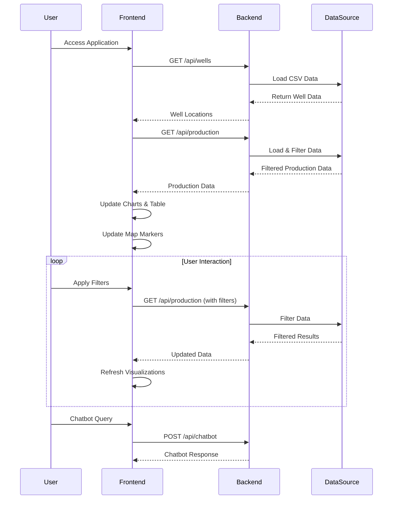

# Oil & Gas Production Analytics Application Workflow

## Overview
This document outlines the workflow and architecture of the Oil & Gas Production Analytics application, a full-stack web application built with Angular (frontend) and FastAPI (backend).

## Sequence Diagram


## Frontend Workflow

### 1. Application Structure
- **App Component**: Main container with navigation
- **Dashboard Component**: Main view with charts and table
- **Map Component**: Interactive map view
- **Shared Components**:
  - Production Chart
  - Regional Chart
  - Production Table
  - Filter Form
  - Chatbot

### 2. Navigation Flow
```
┌─────────────┐
│  App Start  │
└──────┬──────┘
       │
       ▼
┌─────────────┐
│  Navigation │
└──────┬──────┘
       │
       ▼
┌─────────────┐     ┌─────────────┐
│  Dashboard  │────▶│    Map      │
└─────────────┘     └─────────────┘
```

### 3. Data Flow
1. User enters filter criteria
2. Filter form emits filter changes
3. Dashboard component makes API call
4. Data is processed and distributed to:
   - Production Chart
   - Regional Chart
   - Production Table
   - Map

## Backend Workflow

### 1. API Endpoints
- **GET /api/wells**
  - Returns well location data
  - Used by map component
- **GET /api/production**
  - Returns production data
  - Supports filtering by:
    - Date range
    - Well name
    - Region
- **POST /api/chatbot**
  - Handles chatbot interactions
  - Returns predefined responses

### 2. Data Processing
1. CSV file is loaded using Pandas
2. Data is filtered based on request parameters
3. Results are converted to JSON and returned

## Key Features

### 1. Data Visualization
- **Production Chart**: Line chart showing production over time
- **Regional Chart**: Pie chart showing production by region
- **Production Table**: Detailed data in tabular format
- **Interactive Map**: Well locations with popup information

### 2. Data Filtering
- Date range selection
- Well name selection
- Region selection
- Real-time updates

### 3. User Experience
- Responsive design
- Loading states
- Error handling
- Interactive elements
- Chatbot assistance

## Security Considerations
- CORS configuration with specific origins
- Input validation
- Error handling
- Secure API endpoints

## Performance Optimizations
- Lazy loading for map component
- Efficient data processing
- Optimized API responses


## Technical Stack
- **Frontend**: Angular 17
- **Backend**: FastAPI (Python)
- **Data Processing**: Pandas
- **Visualization**: 
  - ngx-charts
  - Leaflet/ngx-leaflet
- **Styling**: CSS
- **Development Tools**:
  - TypeScript
  - Python
  - Git

## Setup and Deployment
1. Backend:
   ```bash
   cd backend
   pip install -r requirements.txt
   uvicorn app.main:app --reload
   ```

2. Frontend:
   ```bash
   cd frontend
   pnpm install
   pnpm start
   ```

## Best Practices Implemented
1. Component-based architecture
2. Responsive design
3. Error handling
4. Code organization
5. Security measures
6. Performance optimization
7. Documentation 