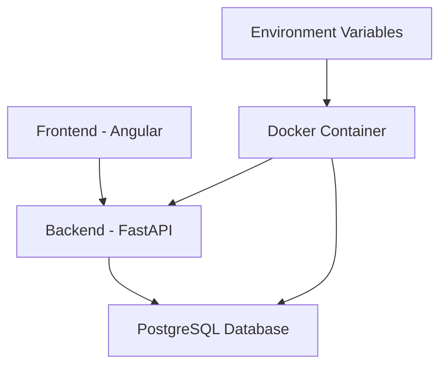
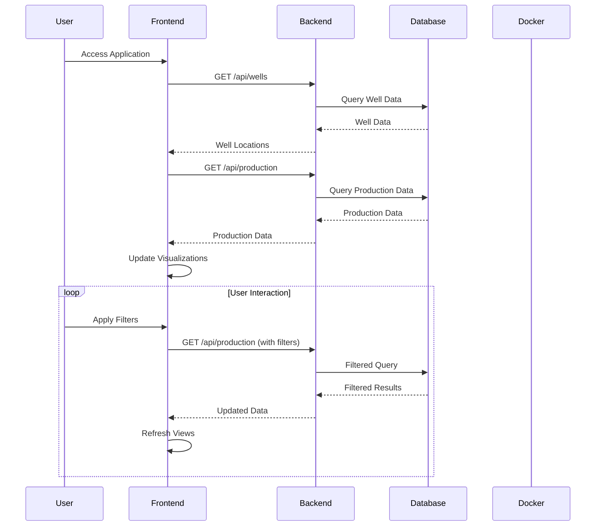

# Oil & Gas Production Analytics Application Workflow

## Overview
This document outlines the workflow and architecture of the Oil & Gas Production Analytics application, a full-stack web application built with Angular (frontend) and FastAPI (backend), containerized using Docker.

## Architecture


## Sequence Diagram


## Frontend Structure

### 1. Components
- **App Component**: Main container with navigation
  - Dashboard link
  - Map link
- **Dashboard Component**: Main view with:
  - Production Chart
  - Regional Chart
  - Production Table
- **Map Component**: Interactive map with well locations


### 2. Navigation Flow
```
┌─────────────┐
│  App Start  │
└──────┬──────┘
       │
       ▼
┌─────────────┐
│  Navigation │
└──────┬──────┘
       │
       ▼
┌─────────────┐     ┌─────────────┐
│  Dashboard  │────▶│    Map      │
└─────────────┘     └─────────────┘
```

## Backend Structure

### 1. API Endpoints
- **Well Endpoints**
  - GET /api/wells
  - POST /api/wells
  - PUT /api/wells/{id}
  - DELETE /api/wells/{id}
- **Production Endpoints**
  - GET /api/production
  - POST /api/production
  - PUT /api/production/{id}
  - DELETE /api/production/{id}


### 2. Database Structure
- **Well Model**
  - id
  - name
  - latitude
  - longitude
  - region
- **Production Model**
  - id
  - well_id
  - date
  - oil_volume
  - gas_volume
  - water_volume

## Docker Configuration

### 1. Services
```yaml
services:
  postgres:
    image: postgres:14
    environment:
      - POSTGRES_USER
      - POSTGRES_PASSWORD
      - POSTGRES_DB
    ports:
      - "5432:5432"
    volumes:
      - postgres_data:/var/lib/postgresql/data

  api:
    build:
      context: .
      dockerfile: Dockerfile
    environment:
      - POSTGRES_SERVER
      - POSTGRES_USER
      - POSTGRES_PASSWORD
      - POSTGRES_DB
      - POSTGRES_PORT
    ports:
      - "${BACKEND_PORT}:8000"
    depends_on:
      postgres:
        condition: service_healthy
```

### 2. Environment Variables
```env
# Application settings
PROJECT_NAME=Oil & Gas Production Analytics
VERSION=1.0.0
API_V1_STR=/api/v1
BACKEND_PORT=8000

# Database settings
POSTGRES_SERVER=postgres
POSTGRES_USER=postgres
POSTGRES_PASSWORD=postgres
POSTGRES_DB=og_production
POSTGRES_PORT=5432
```

## Development Workflow

### 1. Local Development
```bash
# Start services
cd backend
docker-compose up --build

# Run migrations
docker-compose exec api alembic upgrade head
```

### 3. User Experience
- Responsive design
- Loading states
- Error handling
- Interactive elements
- Chatbot assistance

## Security Considerations
- Environment variable management
- Database credentials protection
- CORS configuration
- Input validation
- Error handling
- Secure API endpoints

## Performance Optimizations
- Lazy loading for map component
- Efficient data processing
- Optimized API responses


## Technical Stack
- **Frontend**: Angular 17
- **Backend**: FastAPI (Python)
- **Database**: PostgreSQL
- **ORM**: SQLAlchemy
- **Migrations**: Alembic
- **Containerization**: Docker
- **Development Tools**:
  - TypeScript
  - Python
  - Git

## Setup and Deployment

### 1. Docker Setup (Recommended)
```bash
# Start services
cd backend
docker-compose up --build

# Run migrations
docker-compose exec api alembic upgrade head
```

### 2. Manual Backend Setup
```bash
# 1. Create and activate virtual environment
python -m venv venv
source venv/bin/activate  # On Windows: venv\Scripts\activate

# 2. Install dependencies
pip install -r requirements.txt

# 3. Set up environment variables
# Create .env file in backend directory with:
POSTGRES_SERVER=localhost
POSTGRES_USER=postgres
POSTGRES_PASSWORD=postgres
POSTGRES_DB=og_production
POSTGRES_PORT=5432
BACKEND_PORT=8000

# 4. Initialize database
# Make sure PostgreSQL is running and accessible
alembic upgrade head

# 5. Run the application
uvicorn app.main:app --host 0.0.0.0 --port 8000 --reload
```

### 3. Frontend Setup
```bash
cd frontend
pnpm install
pnpm start
```

### 4. Database Setup (Manual)
```bash
# 1. Install PostgreSQL
# Follow your OS-specific installation instructions

# 2. Create database
createdb og_production

# 3. Create user (if needed)
createuser -P postgres  # Set password when prompted

# 4. Grant privileges
psql -d og_production -c "GRANT ALL PRIVILEGES ON DATABASE og_production TO postgres;"
```

### 5. Troubleshooting
1. **Database Connection Issues**
   - Verify PostgreSQL is running
   - Check connection credentials in .env
   - Ensure database and user exist
   - Verify port is not blocked

2. **Application Errors**
   - Check logs for specific error messages
   - Verify all dependencies are installed
   - Ensure environment variables are set
   - Check database migrations status

3. **Common Issues**
   - Port conflicts: Change BACKEND_PORT in .env
   - Database access: Verify user permissions
   - Migration errors: Run `alembic upgrade head`
   - Dependency issues: Reinstall requirements.txt

## Best Practices
1. Containerized development environment
2. Environment variable management
3. Database version control
4. API documentation
5. Error handling
6. Logging
7. Testing
8. Code organization 